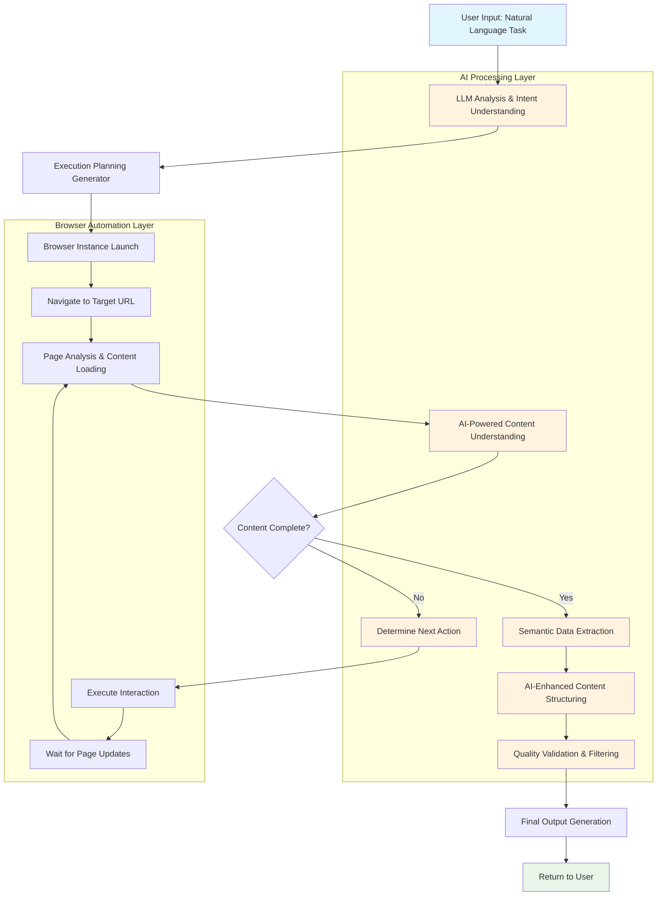

# The Evolution of Web Scraping: How Crawl4AI Revolutionizes Data Extraction with AI  

## TL;DR

**🚀 Evolution of Web Scraping:**  
- **Traditional scrapers** (Beautiful Soup, Scrapy) → **Headless browsers** (Selenium, Playwright) → **AI-powered scrapers** (Crawl4AI)  
- Each generation solved the limitations of the previous one  

**💡 Crawl4AI's Game-Changing Advantages:**  

1. **Natural Language Instructions**: Instead of writing complex CSS selectors, simply describe what you want: *"Extract all product names, prices, and ratings"*  

2. **Semantic Understanding**: AI comprehends content meaning, not just structure - adapts when websites change layout  

3. **Intelligent Behavior**: Automatically plans multi-step actions like *"Navigate → Scroll → Click 'Load More' → Extract → Repeat"*  

4. **Multi-Modal Processing**: Handles text, images, videos, and interactive content with computer vision capabilities  

5. **Advanced Anti-Detection**: Simulates real human behavior patterns, not just simple delays and proxy rotation  

**🔧 Technical Superiority:**  
- **Asynchronous architecture** for high-performance concurrent processing  
- **Self-adaptive strategies** that learn from website patterns  
- **Cloud-native design** with containerization support  
- **Intelligent resource management** optimized for AI workloads  

**🎯 Perfect For:**  
- **AI Training Data Collection**: Clean, structured data ready for machine learning  
- **Business Intelligence**: Real-time competitor monitoring and market analysis  
- **Content Aggregation**: Multi-source information with semantic understanding  
- **Modern Web Apps**: JavaScript-heavy sites that traditional scrapers can't handle  

**⚡ The Bottom Line:**  
Crawl4AI transforms web scraping from a brittle, rule-based process into an intelligent, adaptive system that understands content like a human but operates at machine scale. It's not just a tool upgrade - it's a paradigm shift toward AI-first data extraction.  

**🚨 Trade-offs:**  
Higher resource consumption and complexity compared to simple scrapers, but the intelligence and reliability gains justify the costs for sophisticated use cases.  

---  

*In essence: Crawl4AI is to web scraping what ChatGPT is to text generation - it brings human-like intelligence to automated data extraction.*

## Introduction  

In the rapidly evolving landscape of web technologies, data extraction has become increasingly complex. What started as simple HTML parsing has transformed into sophisticated intelligent data extraction processes. Today, we're witnessing the emergence of next-generation web scraping tools that leverage artificial intelligence to overcome the limitations of traditional approaches. Let's explore how we've arrived at this exciting frontier, and why Crawl4AI represents a paradigm shift in web scraping technology.  

## Part 1: How Headless Browser-Based Scrapers Conquered Traditional Web Scraping  

### The Limitations of Traditional Web Scraping  

Traditional web scraping tools like Beautiful Soup, basic HTTP clients, and early versions of Scrapy were built for a simpler web era. These tools operated under a fundamental assumption: web content was static and fully available after the initial HTTP response. However, this approach revealed several critical limitations:  

**1. JavaScript Rendering Blindness**  
Traditional scrapers could only access the raw HTML sent by servers, missing the vast amount of content dynamically generated by JavaScript. With the rise of React, Vue, Angular, and other frontend frameworks, this became a crippling limitation. Modern web applications often serve minimal HTML and rely entirely on JavaScript to render content.  

**2. Limited Anti-Bot Evasion**  
Early scrapers relied on simple techniques like rotating User-Agent strings and adding delays between requests. These primitive methods were easily detected by modern anti-bot systems that analyze behavioral patterns, browser fingerprints, and technical signatures.  

**3. Static Content Extraction**  
Traditional tools required developers to write rigid extraction rules using CSS selectors or XPath expressions. When websites updated their layouts, these rules would break, requiring manual maintenance and updates.  

### The Headless Browser Revolution  

The introduction of headless browsers like Puppeteer, Playwright, and Selenium WebDriver marked a significant evolutionary leap in web scraping technology. These tools brought several game-changing advantages:  

**1. Full JavaScript Execution**  
Headless browsers run complete browser engines (Chromium, Firefox, WebKit) without the graphical interface. This means they can execute JavaScript, process AJAX requests, and render content exactly as a human user would see it. Single-page applications that were previously impossible to scrape became fully accessible.  

**2. Realistic Browser Simulation**  
By using actual browser engines, these tools naturally generate authentic browser fingerprints, request headers, and network behaviors. This makes them much harder to detect compared to traditional HTTP-based scrapers.  

**3. Dynamic Content Handling**  
Headless browsers can wait for content to load, interact with page elements, scroll to trigger lazy loading, and handle complex user interactions. This capability is essential for modern web applications that rely on user interactions to reveal content.  

**4. Advanced Anti-Detection Features**  
Modern headless browsers support sophisticated stealth techniques, including:  
- Real browser fingerprint simulation  
- Genuine request header patterns  
- Authentic network timing and behaviors  
- Support for cookies and session management  

### The Technical Superiority  

The technical architecture of headless browser-based scrapers offers several advantages:  

- **Complete DOM Access**: Unlike traditional scrapers that work with static HTML, headless browsers provide access to the fully rendered DOM after all JavaScript execution.  
- **Event Handling**: Ability to trigger and respond to JavaScript events, enabling interaction with complex web applications.  
- **Network Interception**: Capability to monitor and modify network requests and responses.  
- **Multi-tab Management**: Efficient handling of multiple browser contexts and tabs for parallel processing.  

## Part 2: How Crawl4AI Transcends Headless Browser Limitations with AI Integration  

While headless browser-based scrapers solved many problems of traditional tools, they introduced new challenges and still fell short in several areas. Crawl4AI addresses these limitations through innovative AI integration.  

### The Remaining Challenges of Headless Browser Scrapers  

**1. Resource Intensity**  
Running full browser engines consumes significant CPU and memory resources. Scaling these solutions for large-scale operations becomes expensive and complex.  

**2. Brittle Extraction Logic**  
Despite having access to rendered content, developers still need to write and maintain extraction rules using selectors and XPath expressions. When sites change their structure, these rules break.  

**3. Limited Content Understanding**  
Traditional headless scrapers extract raw data but lack the ability to understand content semantics, context, or meaning. They can't distinguish between important content and noise.  

**4. Manual Configuration Requirements**  
Each website requires custom configuration for waiting times, interaction patterns, and extraction rules. This manual approach doesn't scale well.  

### Crawl4AI's AI-Powered Advantages  

Crawl4AI represents the next evolutionary step by integrating Large Language Models (LLMs) and AI technologies with headless browser capabilities:  

**1. Natural Language Extraction Instructions**  
Instead of writing complex CSS selectors or XPath expressions, users can describe their extraction needs in natural language. For example: "Extract all product names, prices, and ratings from this e-commerce page." The AI understands the intent and automatically locates the relevant data.  

**2. Semantic Content Understanding**  
Crawl4AI's AI integration enables deep semantic understanding of web content. It can:  
- Distinguish between main content and advertisements  
- Understand content hierarchy and relationships  
- Extract entities, sentiments, and contextual information  
- Recognize content patterns across different site layouts  

**3. Self-Adaptive Extraction Strategies**  
The AI can analyze page structure and content to automatically adjust extraction strategies. When a website changes its layout, Crawl4AI can often continue working by understanding the content semantically rather than relying on structural markers.  

**4. Multi-Modal Content Processing**  
Beyond text extraction, Crawl4AI can process images, videos, and other multimedia content using computer vision capabilities. This enables comprehensive data extraction from modern rich media websites.  

**5. Intelligent Behavior Planning**  
Crawl4AI can break down complex scraping tasks into actionable steps. For instance, if tasked with scraping product reviews, it can autonomously plan and execute: "Navigate to product page → Scroll to reviews section → Click 'Load More' button → Extract review content → Repeat for all pages".  

### The AI-First Architecture Advantage  

Crawl4AI's design philosophy centers around "AI-First" principles:  

**Context-Aware Processing**: The system understands the context of web pages, allowing it to make intelligent decisions about what content to extract and how to structure it.  

**Adaptive Learning**: Crawl4AI can learn from patterns in websites it frequently visits, optimizing its approach for better performance and reliability.  

**Error Recovery**: When extraction fails, the AI can analyze the problem and attempt alternative approaches, significantly improving success rates.  

**Quality Assurance**: Built-in AI-powered validation ensures extracted data meets quality standards, filtering out noise and incomplete information.  

## Crawl4AI Workflow: The Intelligence Behind the Extraction  

Here's how Crawl4AI's AI-enhanced workflow operates:  

### The Workflow Breakdown  

**1. Intent Understanding Phase**  
- User provides natural language instructions  
- LLM analyzes and interprets the extraction requirements  
- System generates an intelligent execution plan  

**2. Adaptive Execution Phase**  
- Browser automation handles technical navigation  
- AI continuously analyzes page content and structure  
- System makes real-time decisions about interactions and waiting  

**3. Intelligent Extraction Phase**  
- AI identifies and extracts relevant content based on semantic understanding  
- Multiple extraction strategies work in parallel for maximum reliability  
- Content is automatically structured and validated  

**4. Quality Assurance Phase**  
- AI-powered validation ensures data quality and completeness  
- Noise filtering and content optimization  
- Final output generation in structured formats  

## Technical Innovation Highlights  

### Advanced JavaScript Handling  
Crawl4AI's integration with Playwright provides sophisticated JavaScript processing capabilities, including:  
- Intelligent waiting mechanisms that adapt to page loading patterns  
- Custom JavaScript injection for complex interaction scenarios  
- Dynamic content detection and extraction  

### Next-Generation Anti-Detection  
The platform implements multi-layered anti-detection strategies:  
- Behavioral pattern simulation based on real user data  
- Dynamic fingerprint rotation and adaptation  
- Intelligent proxy management and rotation  

### Resource Optimization  
Despite using browser engines, Crawl4AI optimizes resource usage through:  
- Selective resource loading (disable images, CSS when not needed)  
- Intelligent browser instance management  
- Efficient memory and CPU utilization strategies  

## Real-World Applications and Benefits  

### AI Training Data Collection  
Crawl4AI excels at gathering high-quality, structured data for AI model training. Its ability to understand content semantics ensures that extracted data is clean and relevant for machine learning applications.  

### Business Intelligence and Market Research  
The platform's natural language interface makes it accessible to business analysts who can extract competitive intelligence without technical expertise.  

### Content Aggregation and Monitoring  
Media companies and content aggregators benefit from Crawl4AI's ability to understand and categorize content automatically, enabling sophisticated content curation workflows.  

## Conclusion: The Future of Intelligent Web Scraping  

Crawl4AI represents a fundamental shift from traditional rule-based scraping to intelligent, AI-driven data extraction. By combining the technical capabilities of modern headless browsers with the understanding and adaptability of large language models, it addresses the core limitations that have plagued web scraping for years.  

The platform's natural language interface, semantic understanding, and adaptive behavior make it not just a tool, but an intelligent agent capable of understanding and executing complex data extraction tasks. As web technologies continue to evolve and become more complex, AI-enhanced scraping tools like Crawl4AI will become essential infrastructure for businesses and researchers who need reliable, high-quality data extraction capabilities.  

The future of web scraping is intelligent, adaptive, and accessible to users regardless of their technical background. Crawl4AI is leading this transformation, making sophisticated data extraction as simple as describing what you need in plain English.  

---  

*Ready to experience the next generation of web scraping? Crawl4AI combines the power of modern browser automation with artificial intelligence to deliver unprecedented data extraction capabilities. Whether you're building AI training datasets, conducting market research, or aggregating content, Crawl4AI transforms complex scraping tasks into simple, natural language instructions.*